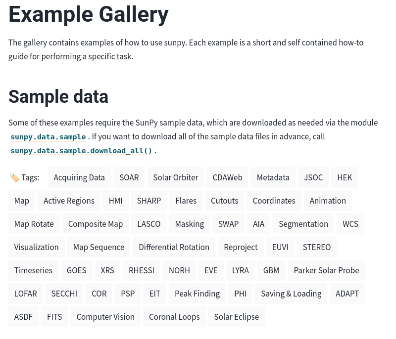

```{python}
#| echo: false
#| eval: true
import os
os.environ["PARFIVE_HIDE_PROGRESS"] = "True"
```

# The SunPy Project Since Last Year


**Feature Releases:**

* `sunpy` 7.1 (December) and 8.0 coming soon
* `ndcube` 2.4 (January)
* `sunkit-image` 0.7 (March)

**Maintenance Releases:**

* `streamtracer` 2.5.0

# Highlights in `sunpy` 7.1 and coming in 8.0

## Support for the Hard X-ray Imager (HXI) on the ASO-S mission (7.1)

:::: {.columns}
::: {.column width="100%"}

:::
::::

[HXIMap](https://docs.sunpy.org/en/stable/generated/api/sunpy.map.sources.HXIMap.html)

*Contribution by Fu Yu*

## More Support for Solar Orbiter in 8.0

The 8.0 release has become a Solar Orbiter Focused release.

## Support for the Solar Orbiter Archive (SOAR) merged into `sunpy`


```{python}
#| echo: true
from sunpy.net import Fido, attrs as a

Fido.search(
    a.Time("2021-02-01", "2021-02-01 01:00"),
    a.Level(1),
    a.soar.Product("EUI-FSI174-IMAGE"),
)["soar"]
```

Thanks to all the contributors to the `sunpy-soar` package over the years.

## Support for New Instruments on Solar Orbiter

:::: {.columns}

::: {.column width="50%"}
Polarimetric and Helioseismic Imager (PHI)


*Contributions by Jonas Sinjan*
:::

::: {.column width="50%"}
Metis


*Still WIP, Contributions by  Aleksandr Burtovoi*
:::

::::

## Tagging of Examples in our Gallery

:::: {.columns}
::: {.column width="100%"}

:::
::::

*Contributions by Stuart Mumford*

# Other Package Updates

## ndcube 2.4

Highlights:

* Add support for serializing all ndcube objects to the ASDF file format.
* Allow addition and subtraction between `NDCube` and `NDData`.
* Add method `to_ndddata` for copying to `NDData` classes.

Changelog: [https://docs.sunpy.org/projects/ndcube/en/stable/whatsnew/changelog.html](https://docs.sunpy.org/projects/ndcube/en/stable/whatsnew/changelog.html#v2-4-0-2026-01-14)

## sunkit-image 0.7

Added a new, simplified and extensible coalignment API.


